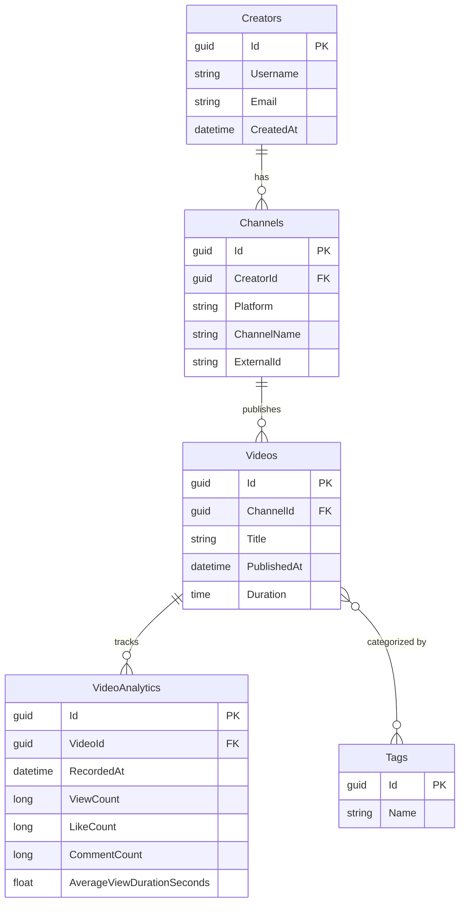

# Creator Analytics

A backend analytics ingestion and reporting engine for content creators. Ingests video metrics, processes time-series data, and exposes RESTful endpoints for dashboard visualization.

Built with Clean Architecture to keep domain logic isolated, testable, and maintainable.

## Tech Stack

- **Framework:** .NET 10 / C# 13
- **Web:** ASP.NET Core Web API
- **Data Access:** Entity Framework Core 10
- **Database:** SQL Server
- **Architecture:** Clean Architecture (Core, Infrastructure, API)

## Project Structure

```
CreatorAnalytics/
├── src/
│   ├── CreatorAnalytics.Core/          # No dependencies. Pure C# domain.
│   │   ├── Entities/                   # Domain models (Creator, Channel, Video, etc.)
│   │   ├── Interfaces/                 # Repository contracts
│   │   └── Models/                     # Report/query models
│   │
│   ├── CreatorAnalytics.Infrastructure/ # Depends on Core.
│   │   ├── Data/                       # DbContext and EF configs
│   │   ├── Migrations/                 # Database migrations
│   │   └── Repositories/               # EF Core implementations
│   │
│   └── CreatorAnalytics.API/           # Depends on Core and Infrastructure.
│       ├── Controllers/                # REST endpoints
│       ├── DTOs/                       # Request/response models
│       └── Program.cs                  # DI setup and pipeline
```

## Getting Started

### Prerequisites

- .NET 10 SDK
- SQL Server (local or Docker)

### Setup

1. Clone the repository and navigate to the project root.

2. Update the connection string in `src/CreatorAnalytics.API/appsettings.Development.json` to point to your SQL Server instance.

3. Apply database migrations:
   ```bash
   dotnet ef database update --project src/CreatorAnalytics.Infrastructure --startup-project src/CreatorAnalytics.API
   ```

4. Run the API:
   ```bash
   dotnet run --project src/CreatorAnalytics.API
   ```

The API is available at `http://localhost:5111`. OpenAPI docs are available at `/scalar/v1`.

## API Endpoints

| Method | Endpoint | Description |
|--------|----------|-------------|
| GET | `/api/channels/{id}` | Get a channel by ID |
| POST | `/api/channels` | Create a new channel |
| GET | `/api/channels/{channelId}/performance` | Get channel performance report |
| GET | `/api/videos/{id}` | Get a video by ID |
| POST | `/api/videos` | Create a new video |
| POST | `/api/videos/{videoId}/analytics` | Add analytics snapshot to a video |

## Domain Model



## License

MIT
