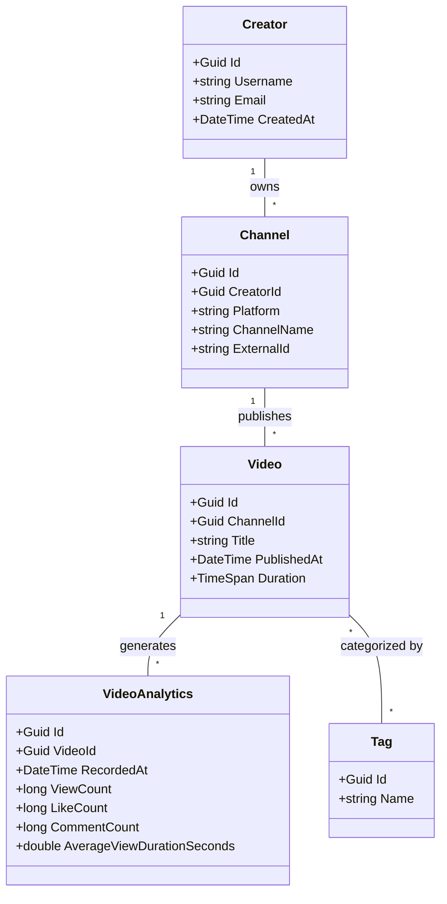
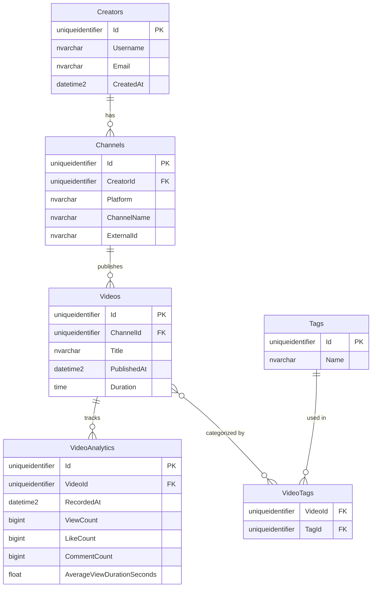

# Creator Analytics Dashboard - Project Guide

## 1. Project Architecture (Clean Architecture)

This structure enforces a strict dependency rule: inner layers (Core) know nothing about outer layers (Infrastructure, API). This isolation makes the core business rules highly testable and maintainable.

```text
CreatorAnalytics/
├── CreatorAnalytics.sln
├── src/
│   ├── CreatorAnalytics.Core/          # No dependencies. Pure C#.
│   │   ├── Entities/                   # Domain Models (Creator, Channel, etc.)
│   │   ├── Interfaces/                 # Repository & Service Interfaces
│   │   └── Exceptions/                 # Domain-specific exceptions
│   │
│   ├── CreatorAnalytics.Infrastructure/ # Depends on Core.
│   │   ├── Data/                       # ApplicationDbContext, Entity Configurations
│   │   ├── Repositories/               # EF Core Implementations
│   │   └── Services/                   # External API clients
│   │
│   └── CreatorAnalytics.API/           # Depends on Core and Infrastructure.
│       ├── Controllers/                # REST Endpoints
│       ├── DTOs/                       # Data Transfer Objects
│       ├── Middleware/                 # Error handling, logging
│       └── Program.cs                  # DI container and pipeline
```

## 2. User Stories

These stories define the scope and expected behavior of the system from an end-user and system perspective:

* **Authentication:** As a Creator, I want to register and log in securely so that my channel data remains private.
* **Channel Management:** As a Creator, I want to register multiple channels (e.g., Main, Shorts, VODs) under my account so I can track their performance independently.
* **Video Management:** As a Creator, I want to view a paginated list of my videos so I can easily browse and manage my content library.
* **Data Ingestion:** As the System, I need to ingest and store daily analytics snapshots for each video to track historical performance without overwriting past data.
* **Analytics & Reporting:** As a Creator, I want to query aggregated metrics (total views, engagement rates) within a specific date range so I can evaluate my channel's growth trajectory.

## 3. Class Diagram (UML)

This diagram illustrates the core C# domain entities and their relationships within the `CreatorAnalytics.Core` layer.



## 4. Database Entity-Relationship Diagram (ERD)

This diagram represents the relational database schema that Entity Framework Core will generate via migrations.



## 5. API Endpoints Reference

### Authentication
* `POST /api/auth/register`
    * **Body:** `{ username, email, password }`
    * **Returns:** JWT Access Token
* `POST /api/auth/login`
    * **Body:** `{ email, password }`
    * **Returns:** JWT Access Token

### Channels
* `GET /api/channels`
    * **Returns:** `List<ChannelDto>` (Scoped to the authenticated user)
* `POST /api/channels`
    * **Body:** `{ platform, channelName, externalId }`
    * **Returns:** `201 Created` with `ChannelDto`
* `GET /api/channels/{channelId}`
    * **Returns:** `ChannelDto`

### Videos
* `GET /api/channels/{channelId}/videos?pageNumber=1&pageSize=20`
    * **Returns:** Paged response of `VideoDto`
* `POST /api/channels/{channelId}/videos`
    * **Body:** `{ title, publishedAt, duration, tags[] }`
    * **Returns:** `201 Created` with `VideoDto`
* `GET /api/videos/{videoId}`
    * **Returns:** `VideoDetailDto` (Includes associated Tags)

### Analytics
* `POST /api/videos/{videoId}/analytics`
    * **Body:** `{ recordedAt, viewCount, likeCount, commentCount, averageViewDurationSeconds }`
    * **Returns:** `201 Created`
* `GET /api/videos/{videoId}/analytics?startDate={date}&endDate={date}`
    * **Returns:** Time-series array `List<VideoAnalyticsDto>` for charting.
* `GET /api/channels/{channelId}/performance?startDate={date}&endDate={date}`
    * **Returns:** Aggregated metrics (e.g., total views across all videos in the channel within the date range).