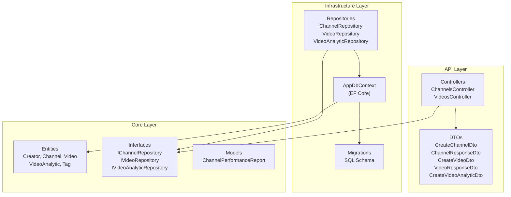
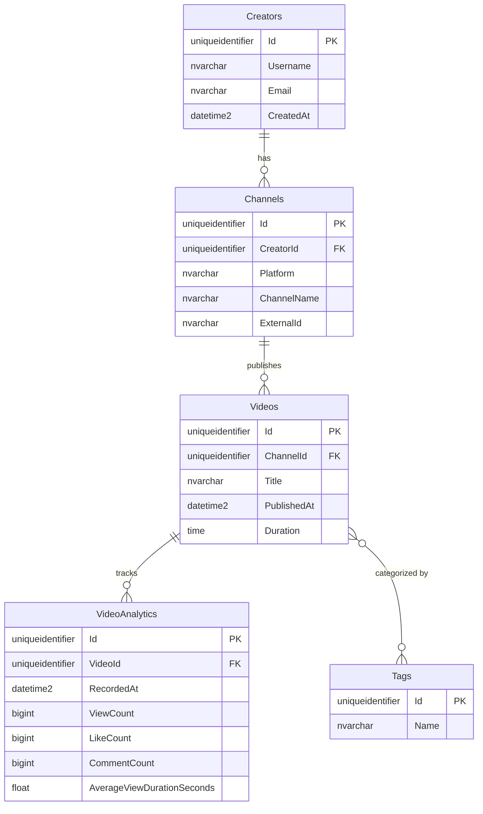
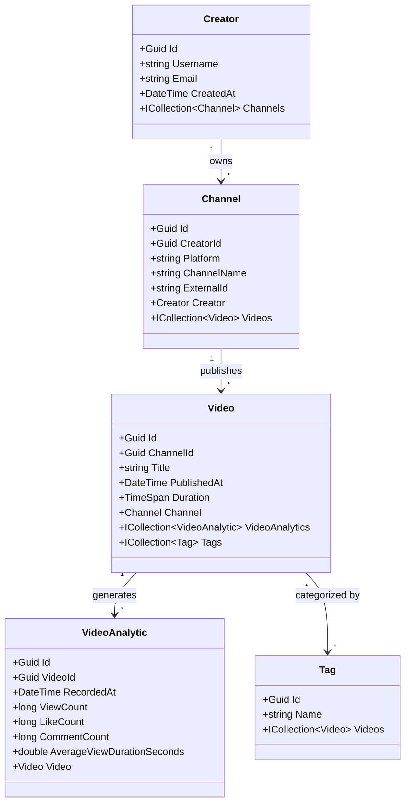
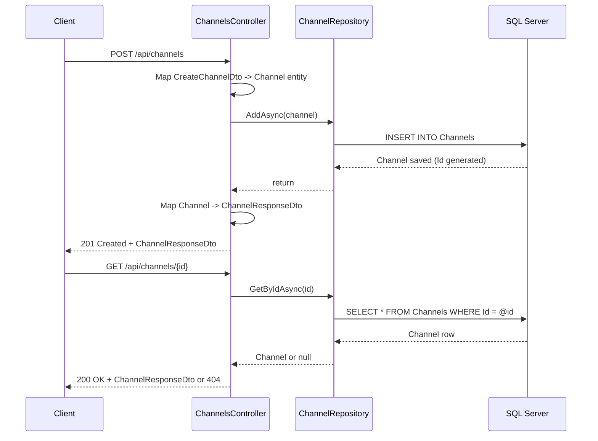

# Creator Analytics - Project Guide

## 1. Architecture Overview

The system uses Clean Architecture with three layers. The dependency rule is strict: Core knows nothing about Infrastructure or API. This keeps business logic isolated and testable.



**Layer responsibilities:**

- **Core** -- Domain entities, repository interfaces, and query models. No external dependencies.
- **Infrastructure** -- EF Core DbContext, Fluent API configuration, repository implementations, and SQL Server migrations.
- **API** -- HTTP controllers, request/response DTOs, and dependency injection wiring in Program.cs.

---

## 2. What Has Been Built

### Phase 1: Foundation

| Component | Status | Details |
|-----------|--------|---------|
| Solution structure | Done | 3 projects with Clean Architecture layering |
| Domain entities | Done | Creator, Channel, Video, VideoAnalytic, Tag |
| Repository interfaces | Done | IChannelRepository, IVideoRepository, IVideoAnalyticRepository |
| EF Core DbContext | Done | AppDbContext with Fluent API relationship config |
| SQL Server migrations | Done | Initial create with all tables and foreign keys |
| Repository implementations | Done | ChannelRepository, VideoRepository, VideoAnalyticRepository |
| Channel endpoints | Done | GET by id, POST create, GET performance |
| Video endpoints | Done | GET by id, POST create |
| Analytics endpoints | Done | POST analytics snapshot for a video |
| OpenAPI docs | Done | Scalar UI at /scalar/v1 |

### What's Next (Planned)

| Feature | Description |
|---------|-------------|
| Creator controller | CRUD endpoints for creators |
| Auth / identity | JWT-based authentication and authorization |
| Input validation | Data annotations on DTOs |
| Pagination | Paged video listing endpoints |
| Date-range filtering | Filter analytics by start/end date |
| Connection string security | Move to user secrets or environment variables |

---

## 3. Entity Relationship Diagram



### Relationships

| Entity A | Relation | Entity B | Foreign Key |
|----------|----------|----------|-------------|
| Creator | 1 -> N | Channel | Channel.CreatorId |
| Channel | 1 -> N | Video | Video.ChannelId |
| Video | 1 -> N | VideoAnalytic | VideoAnalytic.VideoId |
| Video | N -> N | Tag | TagVideo join table |

---

## 4. Class Diagram



---

## 5. API Endpoints

### Channels

| Method | Endpoint | Description | Request Body | Response |
|--------|----------|-------------|-------------|----------|
| GET | `/api/channels/{id}` | Get channel by ID | -- | `ChannelResponseDto` |
| POST | `/api/channels` | Create a new channel | `CreateChannelDto` | `201 Created` + `ChannelResponseDto` |
| GET | `/api/channels/{channelId}/performance` | Get aggregated performance report | -- | `ChannelPerformanceReport` |

### Videos

| Method | Endpoint | Description | Request Body | Response |
|--------|----------|-------------|-------------|----------|
| GET | `/api/videos/{id}` | Get video by ID | -- | `VideoResponseDto` |
| POST | `/api/videos` | Create a new video | `CreateVideoDto` | `201 Created` + `VideoResponseDto` |
| POST | `/api/videos/{videoId}/analytics` | Add analytics snapshot | `CreateVideoAnalyticDto` | `201 Created` |

### DTO Reference

```
CreateChannelDto:       { creatorId, platform, channelName, externalId }
ChannelResponseDto:     { id, platform, channelName }
CreateVideoDto:         { channelId, title, publishedAt, duration }
VideoResponseDto:       { id, channelId, title, publishedAt, duration }
CreateVideoAnalyticDto: { recordedAt, viewCount, likeCount, commentCount,
                          averageViewDurationSeconds }
ChannelPerformanceReport: { channelId, totalViews, totalLikes, totalComments }
```

---

## 6. Request Flow Example



---

## 7. Code Reference

| File | Purpose |
|------|---------|
| `Core/Entities/Creator.cs` | Creator domain entity |
| `Core/Entities/Channel.cs` | Channel domain entity |
| `Core/Entities/Video.cs` | Video domain entity |
| `Core/Entities/VideoAnalytic.cs` | Analytics snapshot entity |
| `Core/Entities/Tag.cs` | Tag entity (many-to-many with Video) |
| `Core/Interfaces/IChannelRepository.cs` | Channel repository contract |
| `Core/Interfaces/IVideoRepository.cs` | Video repository contract |
| `Core/Interfaces/IVideoAnalyticRepository.cs` | Analytics repository contract |
| `Core/Models/ChannelPerformanceReport.cs` | Aggregated report model |
| `Infrastructure/Data/AppDbContext.cs` | EF Core DbContext with relationship config |
| `Infrastructure/Repositories/ChannelRepository.cs` | Channel CRUD implementation |
| `Infrastructure/Repositories/VideoRepository.cs` | Video CRUD implementation |
| `Infrastructure/Repositories/VideoAnalyticRepository.cs` | Analytics + reporting implementation |
| `API/Controllers/ChannelsController.cs` | Channel REST endpoints |
| `API/Controllers/VideosController.cs` | Video + Analytics REST endpoints |
| `API/DTOs/*.cs` | Request/response DTOs |
| `API/Program.cs` | DI container, middleware pipeline, OpenAPI setup |
